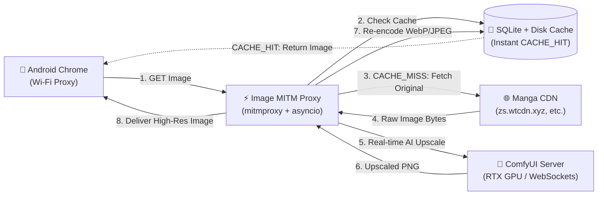

# Image MITM Proxy (ComfyUI AI Upscaling)

A high-performance Python/mitmproxy image proxy designed for a trusted LAN. It intercepts manga and webtoon image requests from mobile devices (Android Chrome, tablets) and **automatically upscales them in real time using ComfyUI (AI Super-Resolution models)**. Processed images are cached on disk to serve subsequent requests instantly without contacting the origin CDN or overloading the GPU.



> [!NOTE]
> This proxy listens on `0.0.0.0:8080` by default with no authentication. Run it only on a trusted LAN. Do not expose it directly to the public internet.

---

## Key Features

- **ComfyUI AI Super-Resolution**: Direct integration with ComfyUI's REST & WebSocket API to upscale images on your local GPU (e.g. `2x-AnimeSharpV3.pth`, `2x-AnimeSharpV4_Fast_RCAN_PU`, `RealESRGAN_x2plus`).
- **Real-Time WebSocket Communication**: Connects to `ws://.../ws` to receive instant notification the millisecond GPU rendering finishes, eliminating polling delay.
- **Mobile-Optimized Re-encoding**: Compresses raw output from ComfyUI (often ~30MB PNG) down to **~1.5 - 2.8MB WebP/JPEG**, saving phone RAM and network bandwidth.
- **Webtoon Long-Strip Handling**: Automatically adapts when upscaled webtoons exceed the WebP format limit (`16,383 px`) by encoding in JPEG, preserving full 17,000+ px resolution without errors.
- **Selective TLS Interception**: Intercepts only specified manga CDN domains in `matching.domains`. All other HTTPS traffic (social media, private browsing) passes through untouched.
- **Fail-Open Safety**: If ComfyUI is offline, busy, or times out, the proxy automatically serves the original image so your reading experience is never interrupted.
- **SQLite + Disk LRU Cache**: Disk-backed cache with configurable TTL and LRU size eviction for instant loading of previously viewed pages.

---

## ComfyUI Workflows

The repository includes pre-built workflows under the `workflows/` directory:

- [workflows/upscale_workflow.json](workflows/upscale_workflow.json): Complete UI workflow graph that can be dragged and dropped directly into the ComfyUI Web UI.
- [workflows/upscale_workflow_api.json](workflows/upscale_workflow_api.json): The API prompt node structure (`LoadImage` ➔ `UpscaleModelLoader` ➔ `ImageUpscaleWithModel` ➔ `SaveImage`) executed by the proxy adapter.

Supported models placed in `ComfyUI/models/upscale_models/`:
- `2x-AnimeSharpV3.pth` *(Default)*
- `2x-AnimeSharpV4_Fast_RCAN_PU.safetensors`
- `RealESRGAN_x2plus.pth`
- `4x-UltraSharp.pth` (or any compatible ESRGAN/RCAN/SwinIR model)

---

## Quick Start Guide

### 1. Start ComfyUI
Start your ComfyUI instance on your PC or local GPU server:
```bash
python main.py --port 8188 --listen 0.0.0.0
```

### 2. Setup and Run Proxy
In this repository:
```bash
# Install dependencies (including mitmproxy and websockets)
uv sync --all-extras

# Create local configuration
cp config.example.yaml config.yaml

# Run the proxy
uv run image-proxy --config config.yaml

# Find your LAN IP address
ip addr  # or 'hostname -I'
```

### 3. Setup Android Device
1. Connect Android to the **same Wi-Fi network** as the PC.
2. In Android Wi-Fi settings, edit network ➔ Set **Proxy** to **Manual**.
3. **Proxy Host**: Enter your PC LAN IP (e.g. `192.168.1.3`).
4. **Proxy Port**: `8080`.
5. Open Chrome on Android and navigate to:
   ```text
   http://mitm.it
   ```
6. Download and install the **Android CA Certificate** (under Settings ➔ Security ➔ CA Certificate).
7. Open your favorite manga reader site in Chrome. Images will be automatically upscaled by ComfyUI!

---

## Configuration Reference (`config.yaml`)

```yaml
proxy:
  host: 0.0.0.0
  port: 8080

matching:
  # Intercept only these manga CDN domains for TLS decryption
  domains:
    - "zs.wtcdn.xyz"
    - "img01.manga18fx.com"
  # Target matching image URLs within allowed domains
  url_regex:
    - "chapter.*\\.webp$"
    - "^https://img01\\.manga18fx\\.com/(upload|online)/.*\\.(jpe?g|webp)(\\?|$)"

processing:
  engine: "comfyui"           # "comfyui" or "watermark" (fallback test mode)
  jpeg_quality: 90            # Quality for JPEG responses (1-100)
  webp_quality: 90            # Quality for WebP responses (1-100)
  max_source_mb: 30           # Source image safety byte limit
  max_pixels: 80000000        # Pixel limit safety guard
  workers: 1                  # GPU concurrency worker pool
  comfyui:
    server_url: "http://127.0.0.1:8188"
    model_name: "2x-AnimeSharpV3.pth"
    timeout_seconds: 45

cache:
  directory: "./data/cache"
  ttl_hours: 168              # 7 days
  max_size_gb: 10             # Maximum cache size
  low_watermark_ratio: 0.90   # Evict down to 90% when full
  cleanup_interval_minutes: 10
  eviction_batch_size: 25
```

---

## Terminal Logs

Watch the proxy terminal to observe real-time behavior:

- `CACHE_MISS`: Request matched; original image fetched and sent to ComfyUI.
- `PROCESSED`: ComfyUI finished upscaling; image compressed and cached.
- `CACHE_HIT`: Image served immediately from local SSD cache (0ms GPU load).
- `FALLBACK`: ComfyUI was offline or timed out; original CDN image delivered seamlessly.
- `EVICTED`: LRU cache cleanup freed expired or surplus disk space.

---

## Running Tests

Run the complete test suite:

```bash
uv run pytest
uv run pytest -m smoke tests/smoke/test_live_proxy.py -q
```


